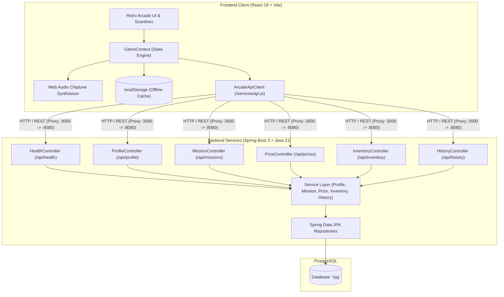

# 🕹️ ARCADE LIFE 1984 — The 80s Retro Life RPG Cabinet

> **Level Up Your Reality:** Translating mundane habits, digital detox milestones, and real-world productivity into an authentic 1980s coin-op arcade progression machine.

[](https://react.dev/)
[](https://spring.io/projects/spring-boot)
[](https://openjdk.org/)
[](https://www.postgresql.org/)
[](https://developer.mozilla.org/en-US/docs/Web/API/Web_Audio_API)
[](#license)

---

## 📖 Table of Contents

- [Overview & Philosophy](#-overview--philosophy)
- [Key Features & Game Mechanics](#-key-features--game-mechanics)
  - [1. 5 Core Life Attributes Matrix](#1-5-core-life-attributes-matrix)
  - [2. Non-Linear Leveling Curve](#2-non-linear-leveling-curve)
  - [3. Streak Combo Multipliers & Shields](#3-streak-combo-multipliers--shields)
  - [4. Zero-Dependency 8-Bit Chiptune Synthesizer](#4-zero-dependency-8-bit-chiptune-synthesizer)
  - [5. CRT Scanline Monitor Emulation](#5-crt-scanline-monitor-emulation)
  - [6. Prize Counter & Real-World Treat Economy](#6-prize-counter--real-world-treat-economy)
  - [7. P1 Inventory Vault & Stat-Boosting Gear](#7-p1-inventory-vault--stat-boosting-gear)
  - [8. Career Audit Trail & Achievements](#8-career-audit-trail--achievements)
- [System Architecture](#-system-architecture)
- [Tech Stack](#-tech-stack)
- [API Reference](#-api-reference)
- [Directory Structure](#-directory-structure)
- [Installation & Quickstart](#-installation--quickstart)
  - [Prerequisites](#prerequisites)
  - [Backend Setup (Spring Boot + PostgreSQL)](#backend-setup-spring-boot--postgresql)
  - [Frontend Setup (React + Vite)](#frontend-setup-react--vite)
  - [Offline / Standalone Mode](#offline--standalone-mode)
- [Contributing & License](#-contributing--license)

---

## 🌟 Overview & Philosophy

Modern gamification apps often fail for two reasons:
1. **Linear XP inflation**: Earning 100 XP per level trivializes early wins and turns long-term discipline into a grind without meaningful milestones.
2. **Disconnected rewards**: You complete tasks on a screen, but there is no tactile feedback, audio gratification, or bridge back to guilt-free real-life rewards.

**ARCADE LIFE 1984** reinvents habit tracking and digital detox through the sensory excitement of a **1984 coin-op arcade cabinet**. Every real-world victory—whether solving algorithmic problems, weightlifting, completing Pomodoro sprints, or staying away from doomscrolling—earns **Score Points (PTS)**, **Renown Experience (XP)**, and **Arcade Tickets (TIX)**. 

With custom Web Audio sound synthesis, non-linear progression algorithms, equippable stat gear, and a full Spring Boot + PostgreSQL backend (backed by offline-first client resilience), **Arcade Life 1984** turns personal growth into an unforgettable retro gaming journey.

---

## 🎮 Key Features & Game Mechanics

### 1. 5 Core Life Attributes Matrix
Every mission is tied directly to one of five core RPG attributes, providing permanent character progression and tangible gameplay advantages:

| Attribute | Focus Area | Real-World Activities | Gameplay Passive Buff |
| :--- | :--- | :--- | :--- |
| 🧠 **INT (Intellect)** | Mental acuity & coding | Algorithms, systems programming, academic reading | **+1% Renown XP** per point for all completed missions |
| ⚔️ **STR (Strength)** | Physical power & training | Calisthenics, gym lifting, high-intensity workouts | **+0.8% High Score Amplifier** per point |
| ⚡ **AGI (Agility)** | Speed & organization | Desk cleanups, inbox zero, rapid task triage | Unlocks **+0.10x combo multiplier bonus** at 12+ AGI |
| 🛡️ **END (Endurance)** | Stamina & detox discipline | 50-min Pomodoro sprints, screen detox, hydration | Expands Max Energy pool by **+5 Energy** per point |
| 🌟 **CHA (Charisma)** | Social & communication | Hackathon presentations, team reviews, networking | **0.5% Haggle Discount** per point at the Prize Counter (up to 25%) |

### 2. Non-Linear Leveling Curve
Rather than arbitrary flat XP milestones, character progression uses an exponential scaling formula:

$$\text{XP Required}(L) = \lfloor 100 \times L^{1.4} \rfloor$$

- **Early Levels (1–3)**: Fast ramp-up gives quick feedback and dopamine to build momentum.
- **Mid Levels (4–9)**: Demands steady habit consistency and routine reinforcement.
- **Master Ranks (10+)**: Bestows prestige titles (`STAGE CLEAR PRO`, `CABINET WARLORD`, `CYBER ARCHON`) with massive ticket bonuses and unspent skill point pools.

### 3. Streak Combo Multipliers & Shields
Consistency triggers the arcade combo engine, multiplying all score points earned across active missions:
- **3-Day Streak**: `1.15x Combo Multiplier` (Cyan)
- **7-Day Streak**: `1.30x Mega Combo` (Yellow)
- **14-Day Streak**: `1.50x Super Arcade Combo` (Magenta)
- **Streak Freeze Shields**: Available in the Prize Counter, preserving your streak if an unplanned rest day occurs.

### 4. Zero-Dependency 8-Bit Chiptune Synthesizer
Built natively using the browser's **Web Audio API**—zero external audio files or network requests required. Procedurally generates classic square and pulse wave tones:
- 🪙 `playCoin()`: Dual-tone arcade chime ($987.77\text{ Hz} \to 1318.51\text{ Hz}$).
- ⚡ `playCheckmark()`: Rapid 4-step power-up arpeggio ($C5 \to E5 \to G5 \to C6$).
- 🔥 `playCombo()`: High-frequency streak laser sound.
- 🎺 `playLevelUp()`: Multi-note victory fanfare.
- 🎟️ `playPurchase()`: Mechanical ticket dispenser chatter.
- 🔊 Keyboard mute/unmute control available in the navigation drawer and config screen.

### 5. CRT Scanline Monitor Emulation
Includes an optional **phosphor CRT monitor filter** complete with horizontal scanlines, flicker, and curved vignette edges, toggleable at any time (`[CRT: ON/OFF]`).

### 6. Prize Counter & Real-World Treat Economy
Redeem tickets earned from clearing life stages for real rewards:
- **Guilt-free Treats**: Coffee vouchers, cheat meals, gaming sessions, book purchases.
- **Tactical Gear**: Items with stat bonuses (e.g., Focus Visor, Ergonomic Gloves).
- **Consumable Power-ups**: XP Boost Elixirs and Streak Freeze Shields.
- Real-time **Charisma Discount Calculation** automatically applies discounts to all prices.

### 7. P1 Inventory Vault & Stat-Boosting Gear
- **Equip / Unequip Gear**: Directly influences your active attributes and recalculates multipliers dynamically.
- **Use Consumables**: Trigger instant XP infusions and shield charges.
- **Redeem Vouchers**: Burn redeemed real-world treats with persistent audit stamps.

### 8. Career Audit Trail & Achievements
- Chronological timeline tracking every stage clear, prize purchase, check-in, and level-up.
- Metric breakdowns showing attribute focus distribution and completion rates.
- Unlockable arcade achievements (`First Coin In`, `Combo Striker`, `Vault Hoarder`, `Arcade Champion`).

---

## 🏗️ System Architecture

The application is structured as a modern full-stack application featuring a decoupled React frontend and a Spring Boot JPA REST backend with PostgreSQL persistence, complemented by an offline-first client cache.



### Resilient Hybrid Data Engine
- **Online Mode**: Queries synchronize seamlessly with Spring Boot REST controllers and persist to PostgreSQL.
- **Offline Fallback**: If the backend is offline or starting up, the frontend gracefully falls back to instant local persistence (`localStorage`), allowing zero disruption and automatic sync.

---

## 💻 Tech Stack

### Frontend
- **Framework**: React 18 (Functional Components, Custom Hooks, Context API)
- **Build Tool**: Vite 5
- **Audio Engine**: Web Audio API (`AudioContext`, `OscillatorNode`, `GainNode`)
- **Icons**: Lucide React
- **Visual Effects**: Canvas Confetti, CSS Scanline Overlays, Keyframe Glows
- **Styling**: Vanilla Modular CSS (Custom Arcade Variables, Responsive Grid)

### Backend
- **Framework**: Spring Boot 3.x / 4.x (`spring-boot-starter-webmvc`, `spring-boot-starter-data-jpa`)
- **Language**: Java 21 (LTS)
- **ORM / Persistence**: Hibernate & Spring Data JPA
- **Database**: PostgreSQL
- **Boilerplate Reduction**: Project Lombok
- **Build & Dependency Management**: Apache Maven (`mvnw`)

---

## 🔌 API Reference

Base URL: `http://localhost:8080` (or proxied via Vite at `/api`)

### Profile Endpoints (`/api/profile`)
| Method | Endpoint | Description |
| :--- | :--- | :--- |
| `GET` | `/api/profile` | Retrieve the active player profile, stats, and attributes |
| `PATCH` | `/api/profile` | Update profile fields (name, callsign, avatar, attributes) |
| `POST` | `/api/profile/check-in` | Execute daily streak check-in and award ticket/XP bonus |
| `POST` | `/api/profile/allocate-skill` | Allocate 1 unspent skill point into a chosen attribute (`INT`, `STR`, etc.) |

### Missions Endpoints (`/api/missions`)
| Method | Endpoint | Description |
| :--- | :--- | :--- |
| `GET` | `/api/missions` | List all active, recurring, and completed missions |
| `POST` | `/api/missions` | Program a new mission with rewards, attribute gains, and subtasks |
| `PUT` | `/api/missions/{id}` | Update an existing mission |
| `DELETE` | `/api/missions/{id}` | Delete a mission by ID |
| `POST` | `/api/missions/{id}/complete` | Mark mission as cleared, apply combo bonuses, and disburse rewards |
| `POST` | `/api/missions/{id}/uncomplete` | Reopen a previously completed mission |
| `POST` | `/api/missions/{id}/subtasks/{subtaskId}/toggle` | Toggle completion status of an individual subtask |

### Prize Counter Endpoints (`/api/prizes`)
| Method | Endpoint | Description |
| :--- | :--- | :--- |
| `GET` | `/api/prizes` | Fetch available shop prizes, gear, and treats |
| `POST` | `/api/prizes` | Create a custom prize or reward |
| `DELETE` | `/api/prizes/{id}` | Remove a prize from the prize counter |
| `POST` | `/api/prizes/{id}/buy` | Purchase a prize with tickets, deduct balance, and add to inventory |

### Inventory Endpoints (`/api/inventory`)
| Method | Endpoint | Description |
| :--- | :--- | :--- |
| `GET` | `/api/inventory` | List all owned gear, usable items, and treat vouchers |
| `POST` | `/api/inventory/{id}/equip` | Toggle equip state of gear items (applies stat bonuses) |
| `POST` | `/api/inventory/{id}/use` | Consume an elixir or activate a streak shield |
| `POST` | `/api/inventory/{id}/redeem` | Mark a real-world treat voucher as redeemed |

### History & System Endpoints
| Method | Endpoint | Description |
| :--- | :--- | :--- |
| `GET` | `/api/history` | Retrieve chronological activity audit trail |
| `POST` | `/api/history` | Log a custom gameplay event or stage clear |
| `GET` | `/api/health` | Health check endpoint (`{"status": "ok"}`) |

---

## 📁 Directory Structure

```text
detox-rpg/
├── README.md                           # Project documentation
├── backend-modified/                   # Spring Boot 3 / Java 21 REST API
│   ├── pom.xml                         # Maven build configuration
│   ├── mvnw / mvnw.cmd                 # Maven wrapper scripts
│   └── src/
│       ├── main/
│       │   ├── java/rpg/backend/
│       │   │   ├── BackendApplication.java
│       │   │   ├── Controller/        # REST Controllers (Profile, Mission, Prize, etc.)
│       │   │   ├── model/             # JPA Entities (Profile, Mission, Prize, InventoryItem)
│       │   │   ├── repository/        # Spring Data JPA Repositories
│       │   │   └── service/           # Business Logic Services
│       │   └── resources/
│       │       └── application.properties # PostgreSQL & JPA database configuration
│       └── test/                      # Unit & integration test suites
│
└── Frontend/                           # React 18 + Vite 80s Arcade Client
    ├── package.json                    # Dependencies & scripts
    ├── vite.config.js                  # Vite server & proxy configuration (Port 3000)
    ├── index.html                      # HTML5 entry with Google Arcade Fonts
    └── src/
        ├── App.jsx                     # Top-level cabinet layout & header vitals
        ├── main.jsx                    # React DOM bootstrapper
        ├── index.css                   # Neon arcade styles, scanlines & animations
        ├── context/
        │   └── GameContext.jsx         # Centralized game state, leveling math & modifiers
        ├── services/
        │   ├── api.js                  # Fetch API client with caching & fallback
        │   └── soundEffects.js         # Web Audio API 8-bit chiptune synthesizer
        └── components/
            ├── Navbar.jsx              # Cabinet sidebar, live vitals, CRT/Mute toggles
            ├── FloatingRewards.jsx     # Floating arcade combat & XP hit numbers
            ├── LevelUpModal.jsx        # Stage clear fanfare modal & confetti
            ├── LandingPage/            # Project showcase & live mini-mission preview
            ├── QuestBoard/             # Mission cards, subtask checklists & creation modal
            ├── Shop/                   # Prize counter, category filtering & custom rewards
            ├── Inventory/              # Equippable vault, consumable buffs & vouchers
            ├── Stats/                  # Character sheet, 5-attribute radar, skill point allocation
            ├── History/                # Career audit timeline, analytics & achievements
            └── Settings/               # Soundboard testing, profile personalization & resets
```

---

## 🚀 Installation & Quickstart

### Prerequisites
- **Node.js**: `v18.x` or higher
- **Java Development Kit (JDK)**: Java 21 (LTS)
- **PostgreSQL**: `v14+` running on `localhost:5432`
- **Git**

---

### Backend Setup (Spring Boot + PostgreSQL)

1. **Configure PostgreSQL Database**:
   Create a database named `rpg`:
   ```sql
   CREATE DATABASE rpg;
   ```

2. **Verify Database Configuration**:
   Check `backend-modified/src/main/resources/application.properties`:
   ```properties
   spring.datasource.url=jdbc:postgresql://localhost:5432/rpg
   spring.datasource.username=postgres
   spring.datasource.password=saipostgres
   spring.datasource.driver-class-name=org.postgresql.Driver
   spring.jpa.hibernate.ddl-auto=update
   spring.jpa.show-sql=true
   ```

3. **Build and Run the Backend**:
   ```bash
   cd backend-modified

   # On Windows (PowerShell / CMD)
   .\mvnw.cmd spring-boot:run

   # On Linux / macOS
   ./mvnw spring-boot:run
   ```
   The backend will start at `http://localhost:8080`. Verify with `curl http://localhost:8080/api/health`.

---

### Frontend Setup (React + Vite)

1. **Install Dependencies**:
   ```bash
   cd Frontend
   npm install
   ```

2. **Start the Development Server**:
   ```bash
   npm run dev
   ```

3. **Open the Cabinet**:
   Navigate to `http://localhost:3000` in your web browser.

---

### Offline / Standalone Mode

The frontend includes an **intelligent offline fallback system**. If you want to test or demonstrate the interface without launching PostgreSQL or the Spring Boot server:
1. Start only the frontend with `npm run dev`.
2. The client will automatically detect that port 8080 is offline and use `localStorage` for all operations (missions, attribute leveling, shop purchases, inventory management).
3. The status indicator on the bottom left will clearly indicate connection status (`ONLINE` vs `CONNECTING...`).

---

## 🕹️ Keyboard Controls & Usability

- **`Tab` / `Shift + Tab`**: Fast focus navigation between arcade push-buttons and stage cards.
- **`Enter` / `Space`**: Push arcade buttons, complete stages, trigger chiptunes.
- **`CRT Toggle`**: Accessible via bottom-left navigation bar (`[CRT: ON/OFF]`).
- **`Audio Toggle`**: Instant synthesizer mute toggle (`[8-BIT: ON/MUTED]`).

---

## 📜 License

This project is open-source and licensed under the [MIT License](LICENSE). Built for educational and productivity enhancement purposes.
